# Mi estación de automatización de redes

## 1. Datos del equipo
    - Integrantes: 
        Samuel Ceniceros Dorantes
        Christian Noe Esparza Meza
        Cesar Alexander Fuentes Garcia
    - Grupo: 
        3IRI1V
    - Asignatura: 
        Automatización de Infraestructura Digital I
    - Fecha:
        Jueves 24 de septiembre 2026 

## 2. Propósito de la práctica

Documentar la preparación y configuración de una estación de trabajo para automatizar tareas de administración y operación de redes.

## 3. Herramientas instaladas

    - Sistema operativo: 
        windows 10 pro
    - Python: 
        python 3
    - Git: 
        cuenta de GitHub 
        cenni2020 , 
        71Alex1
    - Editor o IDE: 
        Visual Studio Code 
    - Librerías y herramientas adicionales: 
        Python 3 y modulo 'venv' para entornos virtuales
        Visual Studio Code (con extensiones de Python)
        postman (cuenta y interfaz)
        Broadcom (cuenta)
        OpenConnect GUI
        Docker Desktop (con soporte WSL 2)
        Vmware Workstation Pro
        GNS3 GUI y GNS3 VM

## 4. Configuración realizada

1. Instalación de las herramientas necesarias.
2. Configuración de las variables de entorno.
3. Creación y activación del entorno virtual.
4. Instalación de las dependencias del proyecto.
5. Configuración del acceso a los dispositivos de red.

## 5. Verificación del entorno

- [ si ] El sistema operativo está actualizado.
- [ si ] Python y Git responden correctamente.
- [ si ] El entorno virtual está configurado.
- [ si ] Las dependencias se instalaron sin errores.
- [ si ] Se validó la conectividad con los dispositivos de red.

## 6. Estructura del repositorio

    ```text
    automatizacion-redes/
    ├── README.md
    ├── requirements.txt
    ├── scripts/
    ├── configuraciones/
    └── docs/
    ```

## 7. Conclusiones

    La estación de trabajo quedó preparada para desarrollar, ejecutar y verificar automatizaciones de red de forma organizada y reproducible.

    Samuel: La configuración del entorno de desarrollo local con Python 3, el módulo venv y Visual Studio Code, combinada con la integración de Git y GitHub, me permitió comprender la importancia de trabajar con entornos aislados y control de versiones estructurado. Esto garantiza que los scripts de automatización se desarrollen de manera limpia, reproducible y colaborativa desde la raíz del repositorio.

    Christian: La importación e integración exitosa de la GNS3 VM sobre VMware Workstation Pro y su vinculación con GNS3 GUI y Docker Desktop demostraron la relevancia de la virtualización y la contenerización en la automatización de redes. Lograr que el servidor virtualizado responda correctamente permite simular topologías y escenarios complejos sin poner en riesgo la infraestructura real.

    Cesar: La incorporación de clientes de API y redes como Postman y OpenConnect GUI, sumada a las pruebas de verificación del sistema y conectividad, dejó la estación de trabajo totalmente preparada para consumir servicios web, probar APIs REST y gestionar dispositivos de forma remota y segura.

## Evidencias
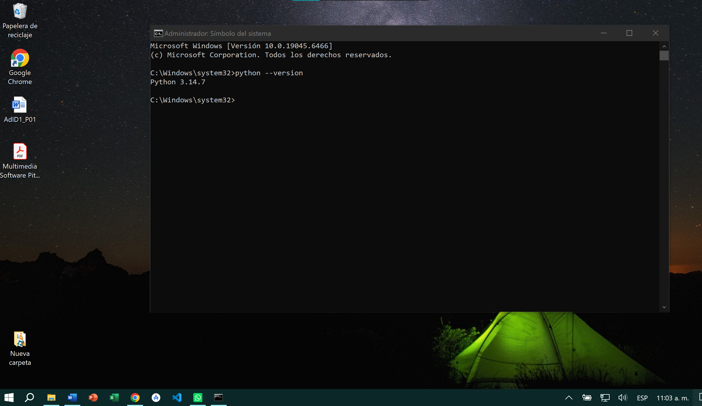
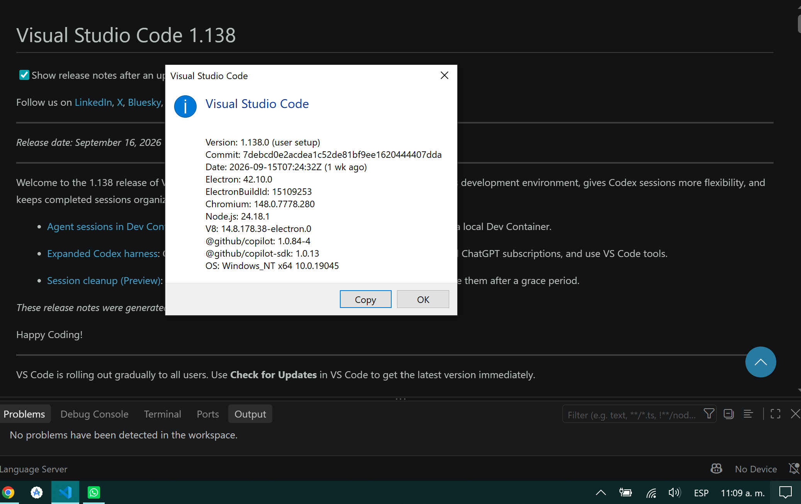
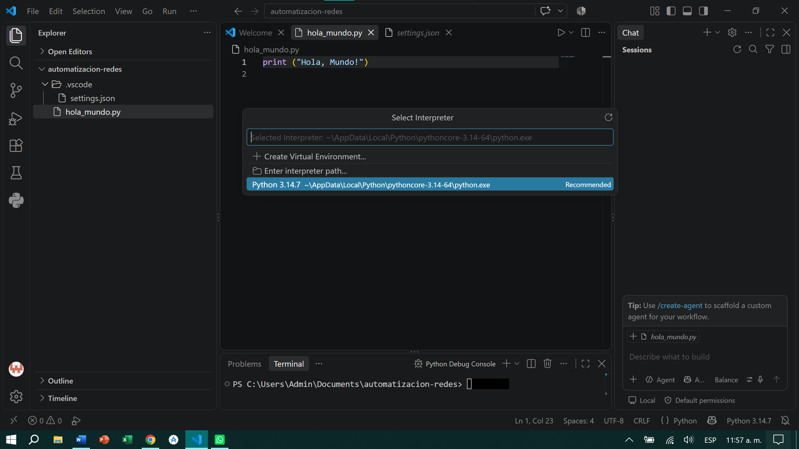
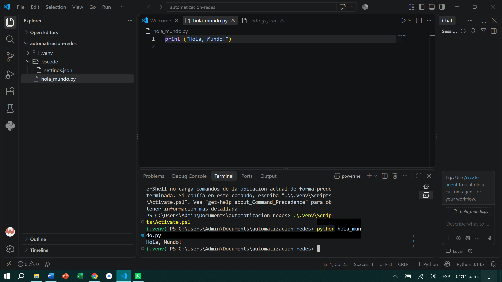

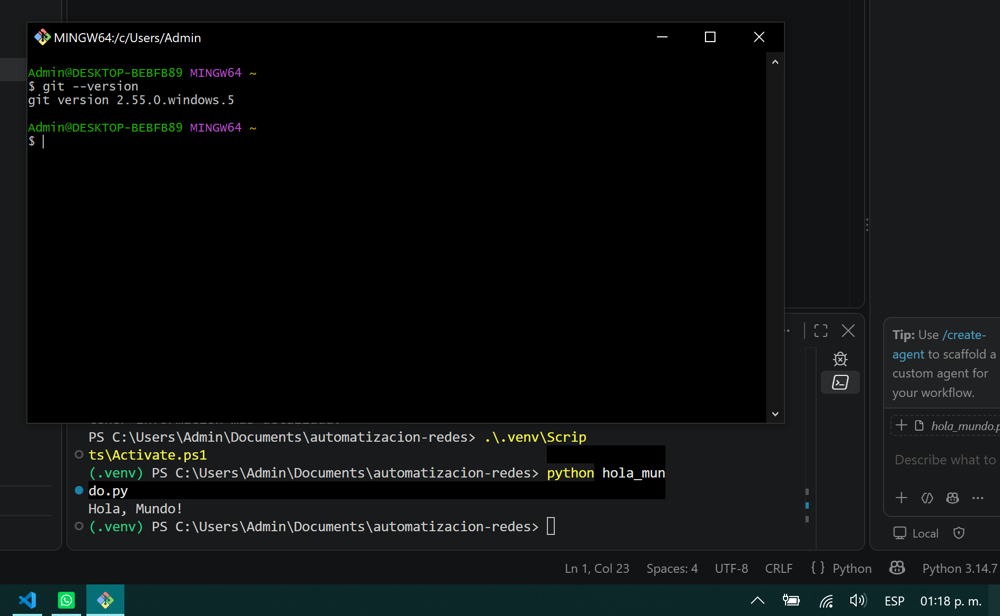
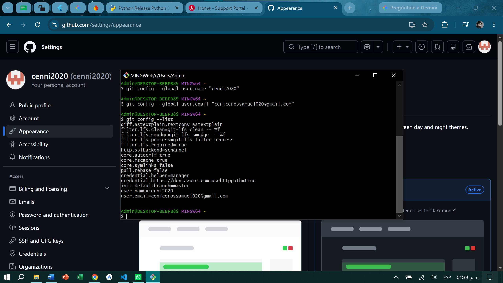
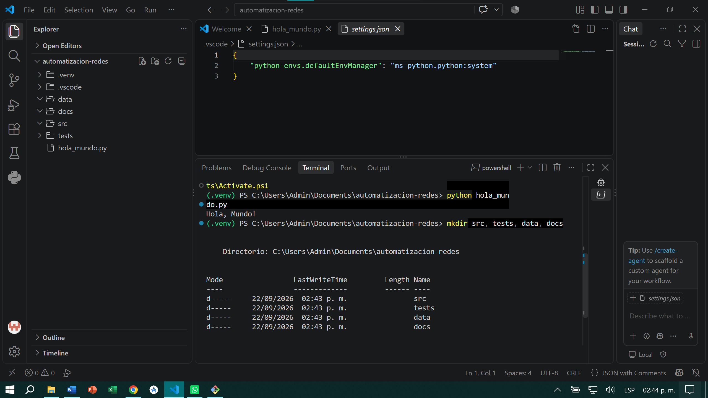
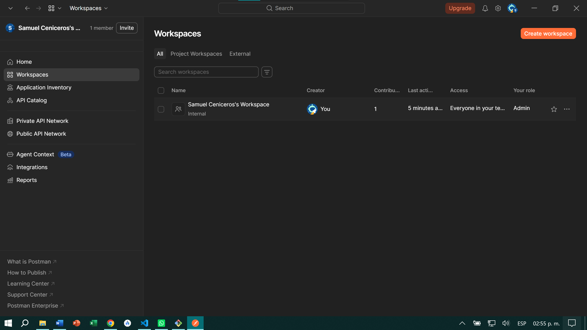
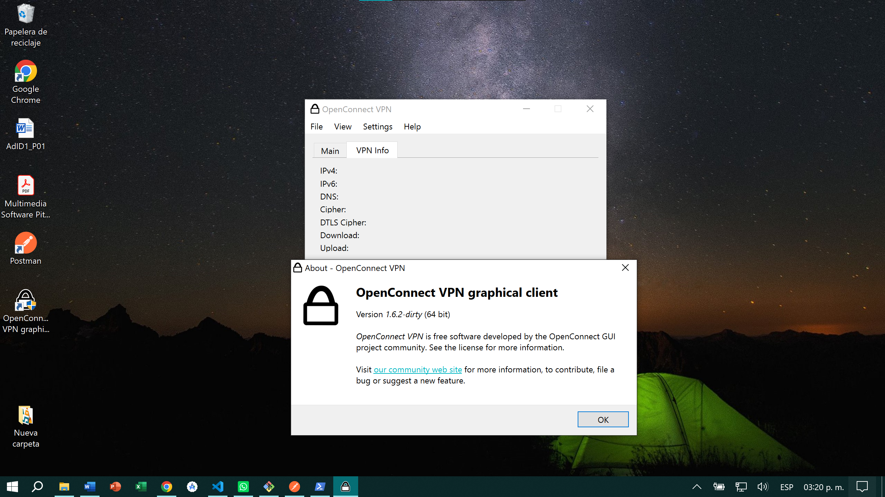
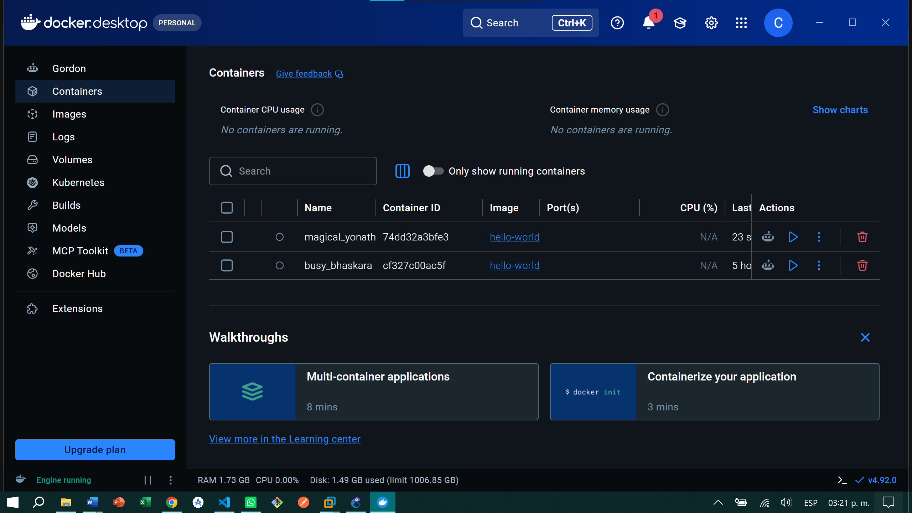
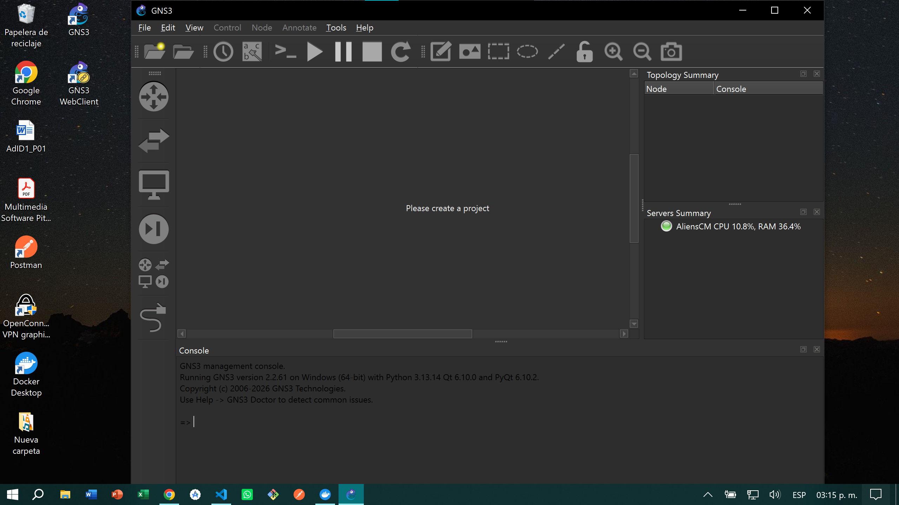
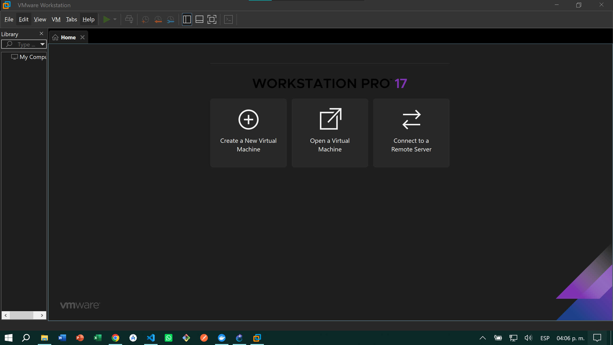
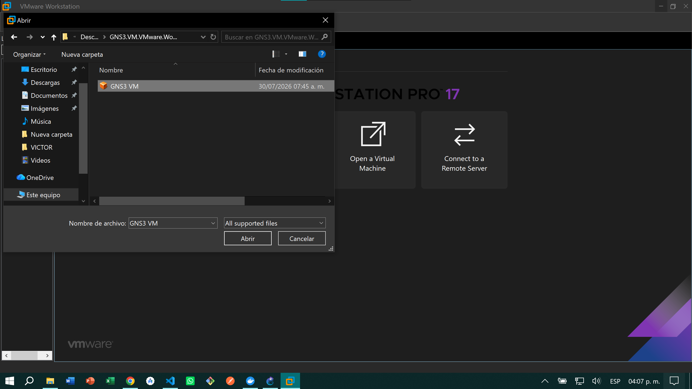
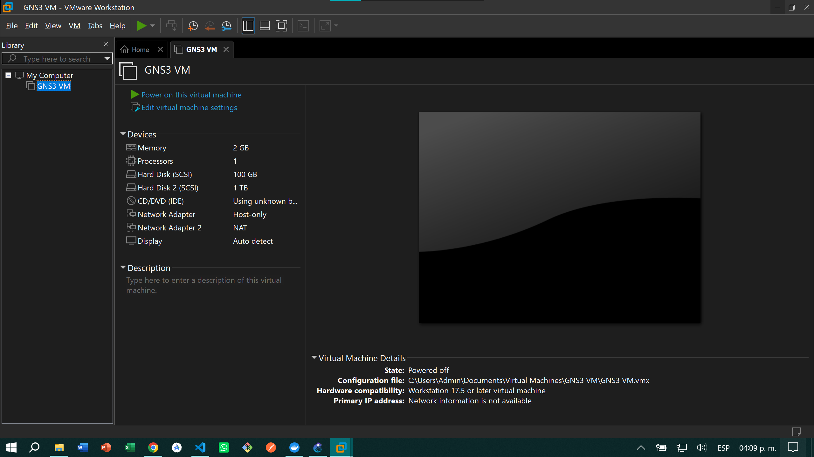
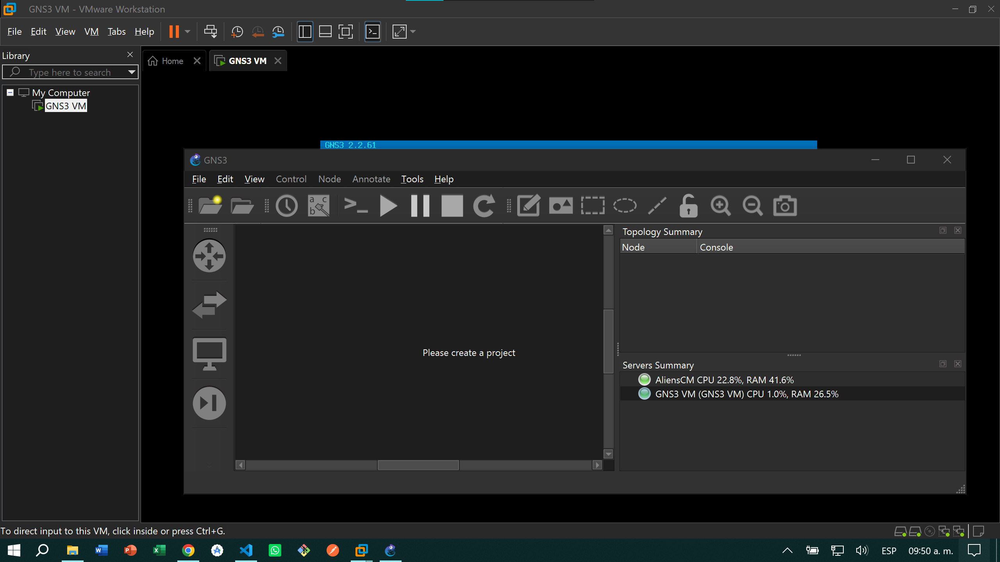

